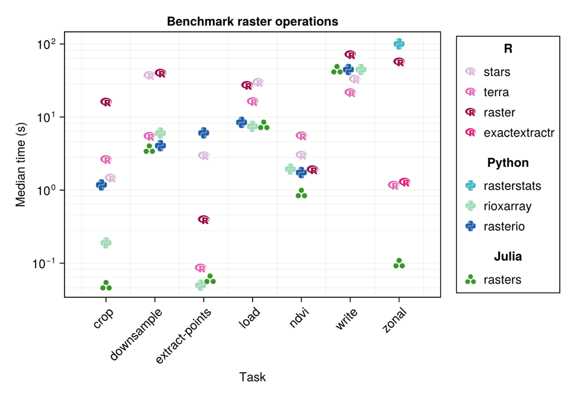
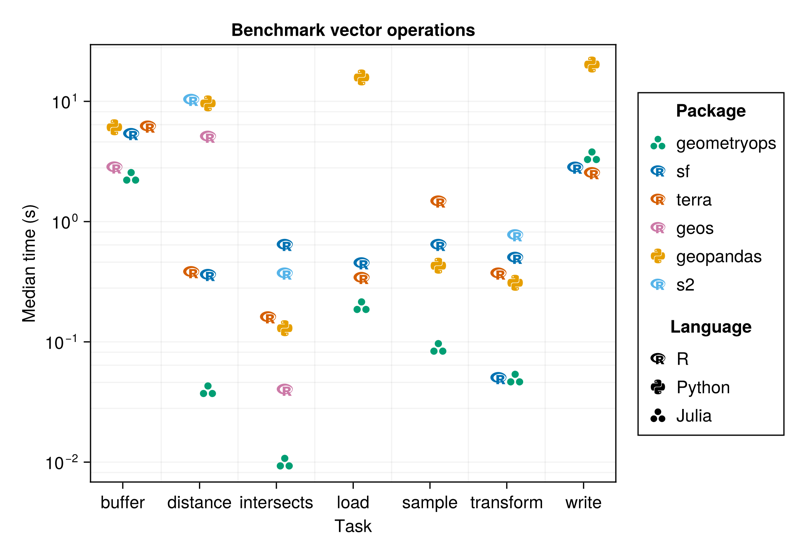

## Access

#### These Slides

https://danlooo.github.io/julia-data-cubes-ogh-summer-school-2026

#### Julia Terminal

https://www.jdoodle.com/online-compiler-julia

## Agenda

1. Recap: Introduction to Julia
1. Geocomputation with Julia: Projection, raster and vector data
1. YAXArrays.jl
1. DGGS.jl

## Who is Julia?

::::: {.columns}

::: {.column width="60%"}
- High-performance programming language
- Designed for scientific computing
- Easy to learn, fast to run
- Dynamic typing like Python
- Speed approaching C
- Great for data science, math, and more
- Multi-paradigm: Functional, procedural, typed
:::

::: {.column width="40%"}

:::

:::::

## Why Julia?

- **Fast**: Just-in-time compilation, near-C performance
- **Easy**: Clean syntax, readable code
- **Dynamic**: Interactive REPL, flexible types
- **Ecosystem getting richer**: 10,000+ packages

## The Two Language Problem

::::: {.columns}

::: {.column width="60%"}
Usually, one needs two languages

- One to prototype: Python, R
- Another one to make it fast: C++, Fortran

This makes it complicated to write and debug.
:::

::: {.column width="40%"}

:::

:::::

## Julia Benchmarks

https://github.com/kadyb/raster-benchmark

## Julia Benchmarks

https://github.com/kadyb/vector-benchmark

## DGGS.jl 

https://github.com/danlooo/DGGS.jl

[slides](dggs-jl.pdf)