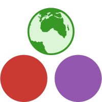
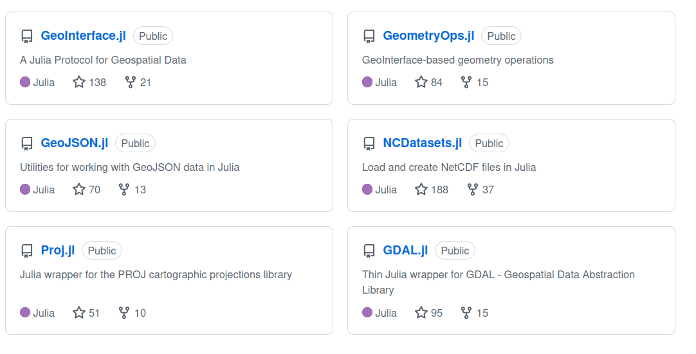
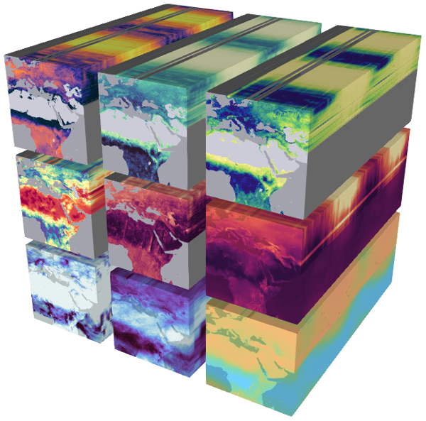
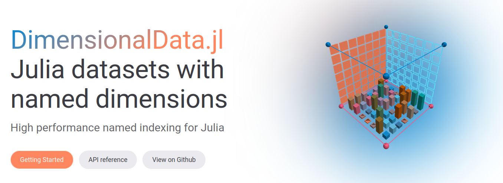
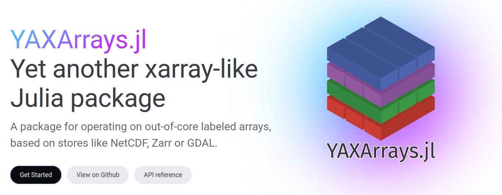

## Access

#### These Slides

https://danlooo.github.io/julia-data-cubes-ogh-summer-school-2026


## Project Environment

- This presentation uses additional packages and data that need to be installed
- The environment were defined in the file `Project.toml` of the GitHub repository

```bash
git clone https://github.com/danlooo/julia-data-cubes-ogh-summer-school-2026.git
cd julia-data-cubes-ogh-summer-school-2026.git
julia --project=.
```
Download and load all packages in Julia:

```julia
using Pkg
Pkg.instantiate()
```

- This is meant as an future exercise 
- Doing this probably takes way longer than this talk

## Agenda

1. Recap: Introduction to Julia
1. Geocomputation with Julia: Projection, raster and vector data
1. Data Cubes
1. YAXArrays.jl
1. DGGS.jl

## Who is Julia?

::::: {.columns}

::: {.column width="60%"}
- High-performance programming language
- Designed for scientific computing
- Easy to learn, fast to run
- Dynamic typing like Python
- Speed approaching C
- Great for data science, math, and more
- Multi-paradigm: Functional, procedural, typed
:::

::: {.column width="40%"}

:::

:::::

## Why Julia?

- **Fast**: Just-in-time compilation, near-C performance
- **Easy**: Clean syntax, readable code
- **Dynamic**: Interactive REPL, flexible types
- **Ecosystem getting richer**: 10,000+ packages


## The Two Language Problem

::::: {.columns}

::: {.column width="60%"}
Usually, one needs two languages

- One to prototype: Python, R
- Another one to make it fast: C++, Fortran

This makes it complicated to write and debug.
:::

::: {.column width="40%"}

:::

:::::

## Julia Benchmarks

https://github.com/kadyb/raster-benchmark


## Julia Benchmarks

https://github.com/kadyb/vector-benchmark


## JuliaGeo

Most important geospatial packages: https://juliageo.org

{height=150px}



## JuliaGeo Talks

- [FOSS4G2019 | JuliaGeo: A Fresh Approach to GeospatialComputing](https://media.ccc.de/v/bucharest-428-juliageo-a-fresh-approach-to-geospatial-computing)
- [JuliaCon2020 | GeoInterface: bringing geospatial packages together](https://www.youtube.com/watch?v=wih_DIWODUs)
- [JuliaCon2022 | State of JuliaGeo](https://www.youtube.com/watch?v=xMRcIpt6Ris)
- [JuliaCon2024 | What’s new with GeoInterface.jl: traits for interoperability](https://www.youtube.com/watch?v=X6UEHg5zjf4)

## Projection

Project coordinates across different projections using PROJ:

```{julia}
using Pkg
Pkg.activate(".")

using Proj
trans = Proj.Transformation("EPSG:4326", "+proj=utm +zone=32 +datum=WGS84")
trans(55, 12)
```

```{julia}
inv(trans)(691875.632137542, 6.098907825129169e6)
```

## Vector Data

```{julia}
using GeoDataFrames
df = GeoDataFrames.read("data/continents.geojson")
```

## Plot Vectors

Makie is a comprehensive Julia package for plotting:

```{julia}
using CairoMakie
plot(df.geometry)
```

## Raster Data

## Load Raster

Most raster julia packages use `ArchGDAL` to use GDAL to load the data:

```{julia}
using Rasters
using ArchGDAL

raster = Raster("data/srtm.tif")
```

## Plot Raster

using Makie package again:

```{julia}
plot(raster; colormap=:deep)
```

## Get a Spatial Dimension

```{julia}
lon = lookup(raster, X)
```

## Subset a Region

```{julia}
@time sub = view(raster, X(-113.2 .. -113.0), Y(37.2 .. 37.5))
```

## Compute

```{julia}
Float32.(raster) * 2
```

## Data Cubes

::::: {.columns}

::: {.column width="60%"}
- feature values: Everywhere, at any time
- stored in big arrays on disk
- better: data hyper-cuboid
- like maps but often chunked in time
- technical: array with named dimensions
:::

::: {.column width="40%"}

:::

:::::

## Data Cube File Formats

- mostly based on the NetCDF Data Model
- examples: NetCDF, Zarr, Folder of TIFs
- virtual data cubes
  - Python `stackstack` let STAC collections present as `xarray.DataArray`
  - Python `kerchunk` let files of different formats present as Zarr
- a *true* data cube has no gaps and allows chunking in any dimension

## Data Cube Framework in Julia

Like previous Rasters.jl, most Julia packages use DimensionalData to describe arrays and axes.



## Overview: Data Cube Packages Based on DimensionalData

| Package | Description |
| --- | --- |
| `Rasters` | Maps at a single time point in memory |
| `DimensionalData` | Simple data cubes in memory |
| `DiskArrays` | Spatiotemporal arrays on disk |
| `YAXArrays` | Spatiotemporal arrays on disk and in memory |
| `DGGS` | Spatiotemporal arrays on disk and in memory on a DGGS |

## YAXArrays.jl



## Time Series Analysis on ERA5 Using YAXArrays

```{julia}
using YAXArrays
using Zarr
ds = open_dataset("data/era5.zarr")
```

## Show Air Temperature at 2m

```{julia}
temperature = ds.t2m
```

## Calculate Regional Mean Temperature

Average temperature over all spatial points:

```{julia}
using Statistics
mean_temperature = mapslices(mean, temperature; dims=(:longitude, :latitude))
```

This reduces the dimensions of the array, yielding a *de facto* vector of time points.

## DGGS.jl 

https://github.com/danlooo/DGGS.jl

[slides](dggs-jl.pdf)

## Resources

- Geocomputation with Julia (in progress): https://jl.geocompx.org/
- YAXArrays docs: https://juliadatacubes.github.io/YAXArrays.jl
- DGGS.jl docs: https://danlooo.github.io/DGGS.jl